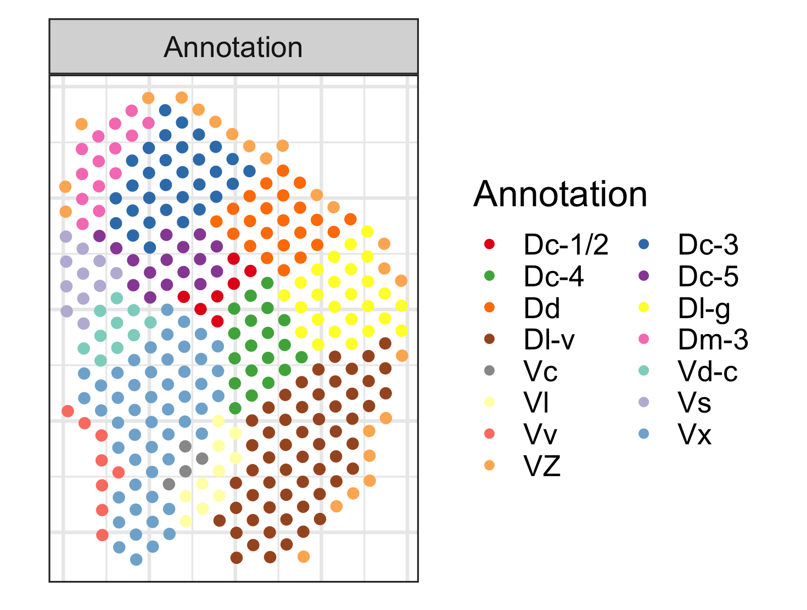
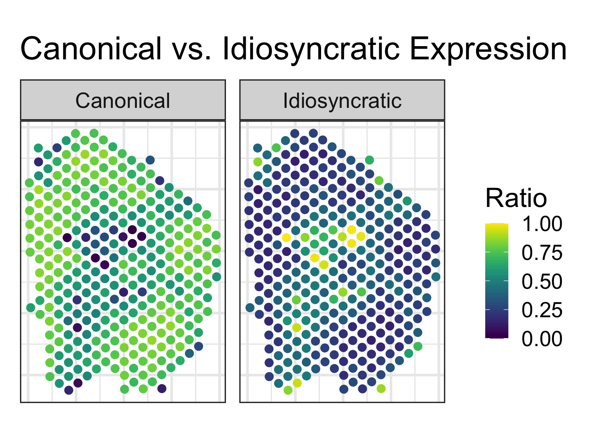
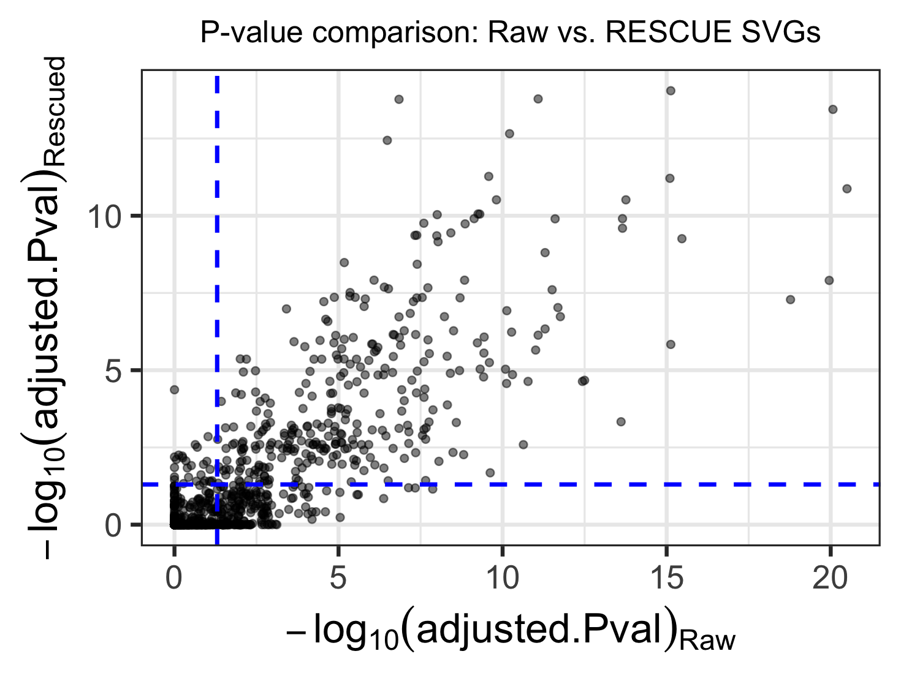

RESCUE Example
================

## 1. Load Data

In this tutorial, we apply RESCUE to the cichlid fish dorsal pallium
Visium dataset from Johnson et al. (2023). We first load the required
dataset and visualize the manual annotation of Visium spots.

``` r
load(file="./fish.rdata") 
```

``` r
library(ggplot2)
library(RColorBrewer)
library(viridis)

colors = c(brewer.pal(9, "Set1"), brewer.pal(10, "Set3"))
dat = cbind(Y.pos, cluster=as.factor(Y.annotation))
dat$facet <- rep("Annotation", nrow(dat))
ggplot(dat, aes(x=x,y=y, color=cluster)) + 
  geom_point(size=2.5) +
  facet_wrap(~facet) +
  coord_fixed(ratio = 1.2*max(dat$x)/max(dat$y)) +
  scale_colour_manual(values=colors) +
  theme_bw(base_size = 20) +
  theme(legend.position = "right",
        axis.text = element_blank(),
        axis.ticks = element_blank(),
        axis.title = element_blank()) +
  guides(color=guide_legend(ncol=2, byrow=TRUE, override.aes = list(size=2))) +
  labs(color="Annotation")
```


## 2. Run RESCUE

Now, we run RESCUE using snRNA-seq data.

``` r
library(RESCUE)
res.RESCUE <- RESCUE(Y.count, X.count, X.cluster, C.grid=NULL, 
                     fc_thresh = 0, expr_thresh = 0, 
                     MIN_OBS = 10, CELL_MIN_INSTANCE = 25,
                     ncores=NULL, chunk.size=NULL, verbose=FALSE)
```

``` r
L.hat <- res.RESCUE$L.hat; L.count <- res.RESCUE$L.raw
R.hat <- res.RESCUE$R.hat; R.count <- res.RESCUE$R.raw
```

``` r
# Normalize and format Canonical expression (L.hat)
dat.L <- L.hat / 1e6
dat.L <- data.frame(Y.pos, Expression = pmin(colSums(dat.L), 1), Type = "Canonical")

# Normalize and format Idiosyncratic expression (R.hat)
dat.R <- R.hat / 1e6
dat.R <- data.frame(Y.pos, Expression = colSums(dat.R), Type = "Idiosyncratic")

# Combine both into a single dataframe
dat_combined <- rbind(dat.L, dat.R)

# Plot using ggplot with facet_wrap
ggplot(dat_combined, aes(x = x, y = y, color = Expression)) +
  geom_point(size = 2.5) +
  scale_color_viridis(direction = 1, limits=c(0,1)) +
  facet_wrap(~Type) +
  coord_fixed(ratio = 1.2 * max(dat_combined$x) / max(dat_combined$y)) +
  theme_bw(base_size = 20) +
  theme(legend.position = "right",
        axis.text = element_blank(),
        axis.ticks = element_blank(),
        axis.title = element_blank()) +
  labs(color = "Ratio", title = "Canonical vs. Idiosyncratic Expression")
```



## 3. Spatially Varying Genes using Raw vs. RESCUE

``` r
library(SPARK)
info <- Y.pos
idx.gene.Y <- which(apply(Y.count, 1, function(x) mean(x!=0)) >= 0.1)
sparkY <- sparkx(Y.count[idx.gene.Y, ], info, numCores=1,option="mixture")
idx.Y <- rownames(sparkY$res_mtest)[which(sparkY$res_mtest$adjustedPval < 0.05)]
```

``` r
idx.gene.R <- which(apply(R.count, 1, function(x) mean(x!=0)) >= 0.1)
sparkR <- sparkx(R.count[idx.gene.R, ], info, numCores=1,option="mixture")
idx.R <- rownames(sparkR$res_mtest)[which(sparkR$res_mtest$adjustedPval < 0.05)]
```

``` r
idx.gene <- intersect(rownames(sparkY$res_mtest), rownames(sparkR$res_mtest))

df_plot <- data.frame(
  gene = idx.gene,
  pval_Y = -log10(sparkY$res_mtest[idx.gene, "adjustedPval"]),
  pval_R = -log10(sparkR$res_mtest[idx.gene, "adjustedPval"]),
  stat_Y = sparkY$stats[idx.gene, 1],
  stat_R = sparkR$stats[idx.gene, 1]
)

# p-value comparison
ggplot(df_plot, aes(x = pval_Y, y = pval_R)) +
  geom_point(alpha = 0.5) +
  geom_vline(xintercept = -log10(0.05), color = "blue", linetype = "dashed", lwd=1) +
  geom_hline(yintercept = -log10(0.05), color = "blue", linetype = "dashed", lwd=1) +
  labs(
    x = expression(-log[10](adjusted.Pval)[Raw]),
    y = expression(-log[10](adjusted.Pval)[Rescued]),
    title = "P-value comparison: Raw vs. RESCUE SVGs"
  ) +
  theme_bw(base_size = 20) +
  theme(plot.title = element_text(size = 15, hjust=0.5))
```


